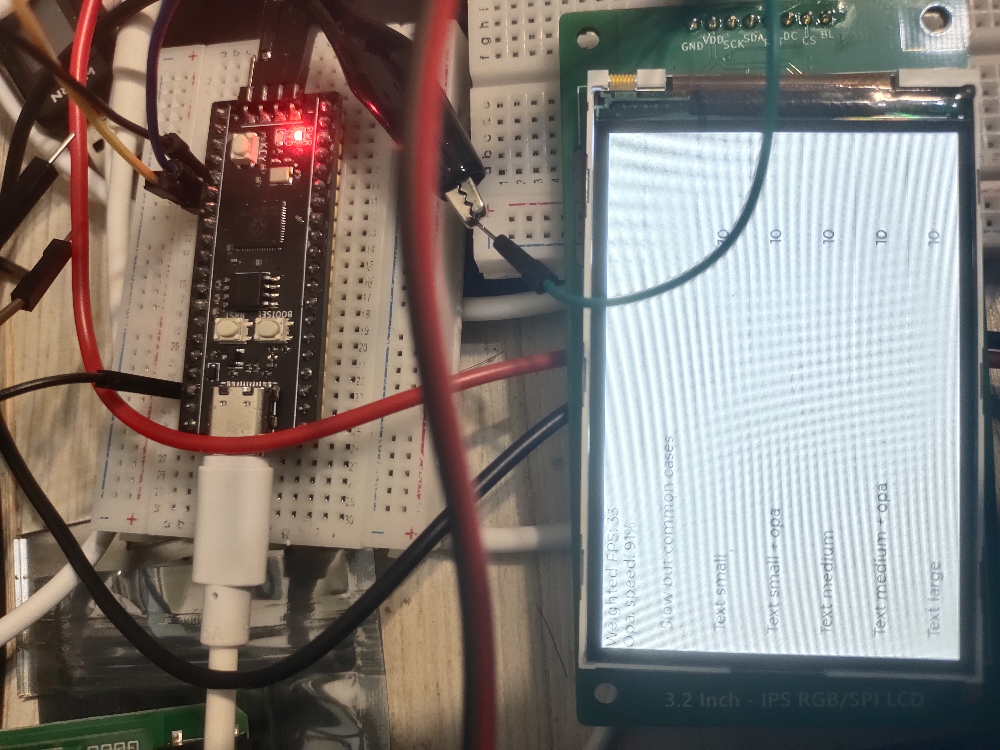

# RP2040_CSDK_LVGL_Examples

这是一个使用`RP2040-csdk`的`LVGL8.3.3`例程。

使用DMA双缓冲驱动 `rm68042 3.2inch IPS LCD 480*320`显示屏

该显示屏没用引出命令/数据切换引脚，使用的协议是9bit SPI，而STM32F1/F4等系列都不支持这种格式，使用RP2040的硬件SPI benchmark效果如下

